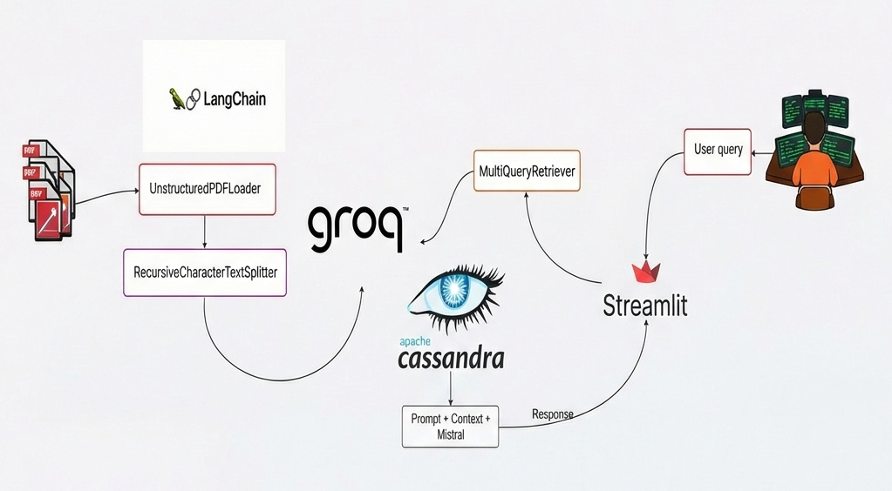

# 📄 PDF Talker — Chat With Your PDFs Using RAG + LLaMA + GROQ

PDF Talker is a **Retrieval-Augmented Generation (RAG)** application that lets users **upload PDFs and ask natural language questions** about their content.

It follows a production-style architecture with **clear separation between ingestion and inference**, powered by:

* 🧠 **LLaMA (on GROQ hardware)** for generation
* ⚡ **GROQ embeddings** for vectorization
* 🗄 **Apache Cassandra** as the vector database
* 🔗 **LangChain** for orchestration
* 💬 **Streamlit** for the chat interface

---

## 🧭 High-Level Workflow Summary

The system is divided into **three logical loops**:

### 🔹 Data Ingestion Pipeline

PDF → Text → Chunks → Embeddings → CassandraDB

### 🔹 Retrieval Strategy

User Query → MultiQuery Expansion → Cassandra Similarity Search

### 🔹 RAG Generation

Context Aggregation → Prompt Construction → LLaMA Inference → Streamlit Response

This ensures **grounded answers strictly based on your documents**.

---

## 🖼 Architecture Diagram

The diagram below shows the complete **end-to-end RAG workflow**, clearly separating:

* **Left loop:** PDF ingestion and embedding storage
* **Top loop:** Multi-query retrieval strategy
* **Bottom loop:** Context-aware LLaMA generation

<p align="center">
  
</p>


---

## 🛠 Tech Stack

<p align="center">
  
  
  
  
  
</p>

<p align="center">
  Streamlit &nbsp;•&nbsp; LangChain &nbsp;•&nbsp; Apache Cassandra &nbsp;•&nbsp; LLaMA &nbsp;•&nbsp; GROQ
</p>

---

## ▶️ Run Locally

```bash
pip install -r requirements.txt
streamlit run app.py
```

---
